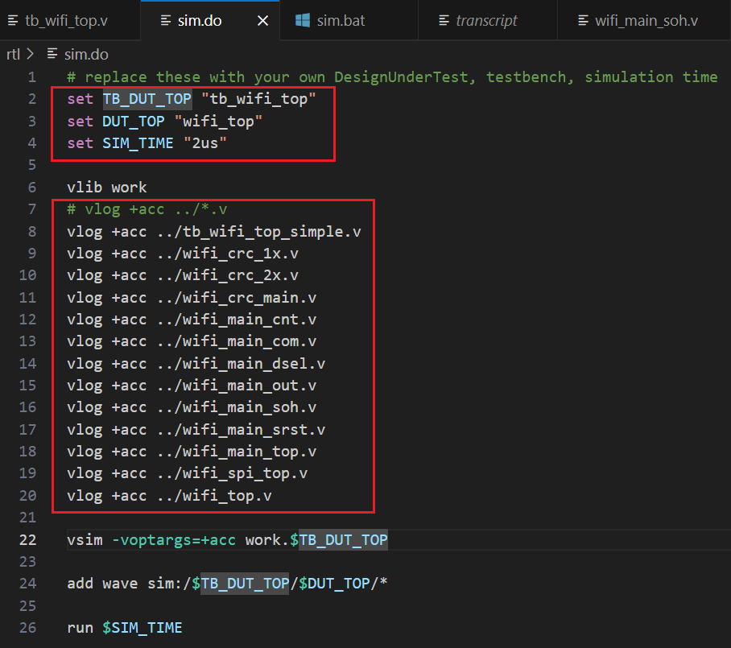
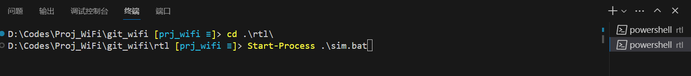

# 在Windows下通过脚本进行RTL仿真

## Environment

- Microsoft Windows 11 - amd64
- ModelSim SE 2020.4

## Copy the scripts to RTL directory

**sim.bat**: Make sim derectory and launch ModelSim with the .do script
```bat
:: run this script in the directory of RTLs, with Windows CMD/PowerShell
:: command: "Start-Process .\sim.bat"
mkdir sim
cd sim
mkdir outputs
vsim -do ../sim.do
```

**sim.do**: The simulation script for ModelSim
```bash
# replace these with your own DesignUnderTest, testbench, simulation time
set TB_DUT_TOP "tb_wifi_top"
set DUT_TOP "wifi_top"
set SIM_TIME "2us"

vlib work
# vlog +acc ../*.v
vlog +acc ../tb_wifi_top_simple.v
vlog +acc ../wifi_crc_1x.v
vlog +acc ../wifi_crc_2x.v
vlog +acc ../wifi_crc_main.v
vlog +acc ../wifi_main_cnt.v
vlog +acc ../wifi_main_com.v
vlog +acc ../wifi_main_dsel.v
vlog +acc ../wifi_main_out.v
vlog +acc ../wifi_main_soh.v
vlog +acc ../wifi_main_srst.v
vlog +acc ../wifi_main_top.v
vlog +acc ../wifi_spi_top.v
vlog +acc ../wifi_top.v

vsim -voptargs=+acc work.$TB_DUT_TOP

add wave sim:/$TB_DUT_TOP/$DUT_TOP/*

run $SIM_TIME
```

## Modified the .do script



## Open a PowerShell terminal in the RTL directory



## PowerShell would launch ModelSim and simulate


**NOTE**: *Do not close the PowerShell, or ModelSim will be terminated.*